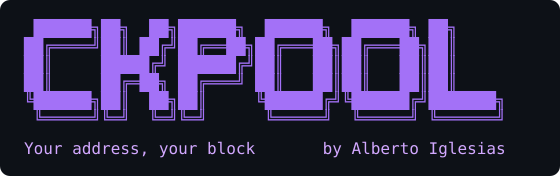

<p align="center">
  
</p>

[](https://github.com/docked-titan-foundation/ckpool/actions/workflows/pipeline.yml)

[](#-verifying-the-image)
[](https://github.com/docked-titan-foundation/ckpool/pkgs/container/ckpool)
[](https://renovatebot.com)
[](https://www.gnu.org/licenses/gpl-3.0)


**A hardened, signed container image for [ckpool](https://bitbucket.org/ckolivas/ckpool) — Con Kolivas' ultra-low-overhead Bitcoin solo-mining stratum server.**
Built from a pinned upstream commit, run non-root, and cosign-signed with an SBOM — because in solo mining the pool decides who a found block pays.

> [!NOTE]
> **Status: beta (`1.0.0-beta`).** The image is built, signed, and tested end to
> end against a real regtest node on every release. Tags may still change before
> `1.0.0` — pin a specific version (or a digest) and read the
> [changelog](CHANGELOG.md) before upgrading. Issues and feedback are welcome.

---

## Contents

- [What is this?](#-what-is-this)
- [Try it in 5 minutes (no real node)](#-try-it-in-5-minutes-no-real-node)
- [Prerequisites](#-prerequisites)
- [Usage](#-usage)
  - [Point a miner at it](#point-a-miner-at-it)
- [Configuration](#-configuration)
- [What this image does differently](#-what-this-image-does-differently)
- [What to expect from solo mining](#-what-to-expect-from-solo-mining)
- [Verifying the image](#-verifying-the-image)
- [Documentation](#-documentation)
- [Version matrix](#-version-matrix)
- [Development](#-development)
- [A note on the dev donation](#-a-note-on-the-dev-donation)
- [Credits](#-credits)
- [Community & contributing](#-community--contributing)
- [License](#-license)

---

## 📝 What is this?

A hardened container image for **ckpool** — Con Kolivas' ultra-low-overhead
Bitcoin mining stratum server — built for **solo mining**.

ckpool bridges Stratum-speaking miners (a Bitaxe, a NerdQAxe, an old ASIC) to a
`bitcoind` that only speaks `getblocktemplate`. In solo mode (`-B`) each miner
authenticates with the Bitcoin address it wants a found block to pay, set as its
stratum username. There is no operator, no cut, and no shared payout.

> **Why a hardened image matters.** In solo mining, the pool assembles the block
> template's coinbase output — the transaction that pays out a found block.
> Whatever image you run decides where that money goes. ckpool's author publishes
> **source only**; every ckpool image on Docker Hub is an unaudited personal build
> by an anonymous account. This one is built in public CI from a pinned upstream
> commit, runs non-root, and ships cosign-signed with an SBOM and SLSA provenance,
> so you can verify exactly what you are running.

<details>
<summary><b>New to this? A 20-second glossary</b></summary>

| Term | In one line |
|---|---|
| **Stratum** | The TCP protocol a miner (e.g. a Bitaxe) speaks to a pool. ckpool is a stratum *server*. |
| **Solo mining** | You mine to *your own* node. Find a block and the whole reward is yours — but blocks are rare (see below). |
| **`getblocktemplate` (RPC)** | How ckpool asks bitcoind "what should I mine on?". Miners can't speak this; ckpool translates. |
| **Coinbase** | The first transaction in a block — the one that pays the reward. In solo mode it pays the miner's username address. |
| **ZMQ** | A fast side-channel bitcoind uses to tell ckpool "a new block just landed," so it doesn't have to poll. |
| **Difficulty / share** | Miners submit low-difficulty "shares" as proof of work; `mindiff`/`startdiff` tune how hard those are. |

</details>

## 🏁 Try it in 5 minutes (no real node)

You don't need a synced mainnet node to see this work. The integration test builds
the image, boots a throwaway `bitcoind -regtest` (a private, instant chain), points
ckpool at it, and drives a miner through the **full path** — subscribe over stratum,
get a `mining.notify` job that ckpool could only build from a real
`getblocktemplate`:

```bash
git clone https://github.com/docked-titan-foundation/ckpool.git
cd ckpool
mise install         # installs the pinned toolchain (docker tooling, shellcheck…)
mise run test        # builds the image, boots regtest + ckpool, mines end to end
```

It finishes in seconds — regtest needs no chain sync. This is exactly what CI runs
on every release, so a green run here is the same green run that gates a publish.

## 📦 Prerequisites

| You need | Why |
|---|---|
| **Docker** (or any OCI runtime / Kubernetes) | To run the image. |
| A **`bitcoind`** reachable over RPC (and ideally ZMQ) | ckpool has no chain of its own; it builds work from the node's `getblocktemplate`. See requirements below. |
| A reachable **stratum address** (host port, or a LoadBalancer on Kubernetes) | Stratum is raw TCP — miners connect straight to it, not through an HTTP proxy. |
| A **Bitcoin address** you control | It goes on the miner as the username; a found block pays it. |

### Bitcoin node requirements

- **Not pruned.** The node must be able to serve full block templates.
- **Fully synced.** `getblocktemplate` refuses to serve while
  `initialblockdownload` is true, so ckpool cannot hand out work until the chain
  has caught up.
- **ZMQ enabled** (recommended) so ckpool learns about new blocks immediately
  instead of polling — set `zmqblock` in the config to match:

  ```text
  zmqpubrawblock=tcp://0.0.0.0:28332
  ```

## 🚀 Usage

ckpool needs a config file (it carries the bitcoind RPC credential, so none is
baked into the image) and a bitcoind reachable over RPC + ZMQ.

```bash
docker run -d --name ckpool \
  -p 3333:3333 \
  -v "$PWD/ckpool.conf:/config/ckpool.conf:ro" \
  ghcr.io/docked-titan-foundation/ckpool:<version>   # pin a version, or a digest
```

A minimal solo `ckpool.conf`:

```json
{
  "btcd": [{ "url": "bitcoind:8332", "auth": "bitcoin", "pass": "<rpc password>", "notify": true }],
  "serverurl": ["0.0.0.0:3333"],
  "zmqblock": "tcp://bitcoind:28332",
  "mindiff": 1,
  "startdiff": 1000,
  "logdir": "/var/lib/ckpool/logs"
}
```

> Pin the image by `<version>` (see the [version matrix](#-version-matrix)) or by
> `@sha256:…` digest. Pinning is the same discipline this image applies to its own
> upstream source.

For **Kubernetes**, use the
[bitcoin-stack](https://github.com/docked-titan-foundation/bitcoin-stack) chart,
which renders this config, wires the node and pool together, and pins this image
by digest.

### Point a miner at it

Configure the miner (a Bitaxe, NerdQAxe, or an ASIC) with:

| Field | Value |
|---|---|
| **URL / host** | `stratum+tcp://<host>:3333` |
| **Username / worker** | `bc1q…yourAddress` — **your** payout address (optionally `.workername`) |
| **Password** | `x` (anything; solo mode ignores it) |

If a miner finds a block, the coinbase pays the address in that username — so
double-check it's *yours*.

## 🔧 Configuration

`ckpool.conf` is JSON. The keys you actually reach for:

| Key | What it does |
|---|---|
| `btcd[].url` | bitcoind RPC address, `host:port`. |
| `btcd[].auth` / `btcd[].pass` | The node's `rpcuser` / `rpcpassword`. |
| `btcd[].notify` | `true` lets bitcoind push block notifications to ckpool. |
| `serverurl` | Stratum bind address(es), e.g. `["0.0.0.0:3333"]`. |
| `zmqblock` | bitcoind ZMQ endpoint (`tcp://host:28332`) — instant new-block signal instead of polling. |
| `mindiff` | Minimum share difficulty a miner can be set to. |
| `startdiff` | Difficulty new miners start at, before vardiff adjusts them. |
| `donation` | Optional percentage of solved blocks donated to upstream (see [the note below](#-a-note-on-the-dev-donation)). |
| `logdir` | Where ckpool writes its logs (`/var/lib/ckpool/logs` in the image). |

The image runs `ckpool -B` (solo) as **uid 1000**, with the config at
`/config/ckpool.conf`, the sockets under `/tmp/ckpool`, and logs under
`/var/lib/ckpool` — all writable by the unprivileged user.

## ✨ What this image does differently

ckpool's author publishes **source only** — no releases, no official image. Every
ckpool image on Docker Hub is an unaudited personal build by an anonymous account.
Since this process assembles the coinbase output that pays out a solved block —
it decides who gets the money — that is not a supply chain you want to guess at.

| | A typical Docker Hub ckpool | This image |
|---|---|---|
| Provenance | anonymous account, no signature | cosign-signed, SLSA provenance, SPDX SBOM |
| Source | "trust me" | a **pinned** upstream commit, re-asserted after fetch |
| User | often root | **non-root** (uid 1000) |
| Base | often unpinned | pinned by digest, rebuilt and re-scanned weekly |
| Init | bare process | `tini` (signal forwarding, zombie reaping) |
| Dev donation | whatever the config shipped | **you** decide — `donation` is not silently set |

## 🎲 What to expect from solo mining

Be clear-eyed: **solo mining is a lottery.** With home-scale hardware (a Bitaxe, a
few ASICs) the odds of *your* miner finding a block are very long — think of it as
a lottery ticket that also strengthens the network, not as income. When you do win,
you win the **entire** block reward, paid straight to your address with no operator
in the middle. People run this for **sovereignty** and the lottery upside; if you
want steady, proportional payouts, that's pooled (non-solo) mining against a third
party, which is a different thing than ckpool `-B` is for.

## 🔐 Verifying the image

Every release is cosign-signed (keyless) with an SPDX SBOM attestation — so you can
prove it came from this repository's CI and not from someone else.

```bash
cosign verify ghcr.io/docked-titan-foundation/ckpool:<version> \
  --certificate-oidc-issuer https://token.actions.githubusercontent.com \
  --certificate-identity-regexp "https://github.com/docked-titan-foundation/ckpool"

cosign verify-attestation --type spdxjson \
  ghcr.io/docked-titan-foundation/ckpool:<version> \
  --certificate-oidc-issuer https://token.actions.githubusercontent.com \
  --certificate-identity-regexp "https://github.com/docked-titan-foundation/ckpool"
```

Inspect which upstream ckpool commit is baked in:

```bash
docker inspect ghcr.io/docked-titan-foundation/ckpool:<version> \
  --format '{{index .Config.Labels "org.opencontainers.image.upstream.revision"}}'
```

## 📚 Documentation

| Doc | What's in it |
|---|---|
| [Contributing](CONTRIBUTING.md) | Dev setup, the release/versioning model, and the digest/commit-pinning policy. |
| [Security policy](SECURITY.md) | Scope, and how to report a vulnerability responsibly. |
| [Changelog](CHANGELOG.md) | Auto-generated from conventional commits. |
| [bitcoin-stack](https://github.com/docked-titan-foundation/bitcoin-stack) | The Helm chart that runs this image alongside a hardened Bitcoin node. |

## 📋 Version Matrix

The image tag tracks *this repo's* releases; the ckpool commit column records
which upstream source is compiled in (upstream has no versions of its own).

### Stable Releases

| Version | ckpool commit | Base | Date |
|---|---|---|---|

### Beta Releases

| Version | ckpool commit | Base | Date |
|---|---|---|---|
| 1.0.0-beta.1 (latest beta) | `37984cff4373` | bookworm-slim | 2026-07-23 |

## 🧰 Development

Tooling is pinned in `.mise.toml`; [mise](https://mise.jdx.dev) installs it and
runs the tasks.

```bash
mise install         # install the pinned toolchain
mise tasks           # list every task

mise run build       # build the image locally
mise run test        # build, then boot it against a regtest node and mine end to end
mise run lint        # hadolint + shellcheck
mise run precommit
```

`mise run test` is the one that matters: a container that boots is not the same as
a stratum server that mines. It builds the image, boots a throwaway `bitcoind
-regtest` sidecar, and asserts non-root, solo (`-B`) mode, a bound stratum port,
and that a subscribing miner receives a `mining.notify` job built from a real
`getblocktemplate`. Set `WITH_REGTEST=0` for a lean, no-bitcoind smoke test.

Upstream bumps arrive as Renovate PRs that move `ARG CKPOOL_COMMIT` in the
`Dockerfile`. They are **never auto-merged** — this is the code that decides where a
found block pays, so read the upstream diff first.

## 💜 A note on the dev donation

Upstream ckpool contributes 0.5% of solved blocks to its author **in pool mode**;
solo mode does not donate unless you set `"donation"` yourself. This image changes
nothing about that — supporting the author is a choice you make in your config, not
one made for you. ckpool is excellent software; if you run it, consider it.

## 🙏 Credits

This image packages and hardens — it does not reimplement — **ckpool** by
**Con Kolivas**, published as source at
[bitbucket.org/ckolivas/ckpool](https://bitbucket.org/ckolivas/ckpool). All the
mining logic is theirs; the value added here is a reproducible, signed, non-root
build of it.

Sibling projects under the [Docked Titan Foundation](https://github.com/docked-titan-foundation):
the [public-pool](https://github.com/docked-titan-foundation/public-pool) image
(the other supported solo pool) and the
[bitcoin-stack](https://github.com/docked-titan-foundation/bitcoin-stack) chart
that runs them.

## 🤝 Community & contributing

- 🐛 **Found a bug or have an idea?** Open an
  [issue](https://github.com/docked-titan-foundation/ckpool/issues) or start a
  [discussion](https://github.com/docked-titan-foundation/ckpool/discussions).
- 🔧 **Want to contribute?** See [CONTRIBUTING.md](CONTRIBUTING.md) — PRs target the
  `beta` branch.
- 🔐 **Security issue?** Please follow [SECURITY.md](SECURITY.md) (don't open a
  public issue).
- 💜 **Support the project:** [Sponsor on GitHub](https://github.com/sponsors/albertoig).
- ⭐ **If this saved you from trusting a random Docker Hub image, star the repo** —
  it helps other self-hosters find it.

## 📄 License

[GPL-3.0](LICENSE), matching upstream ckpool.
